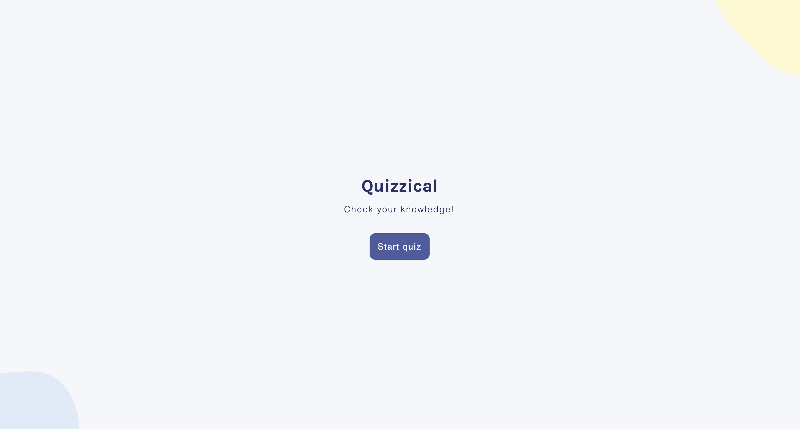
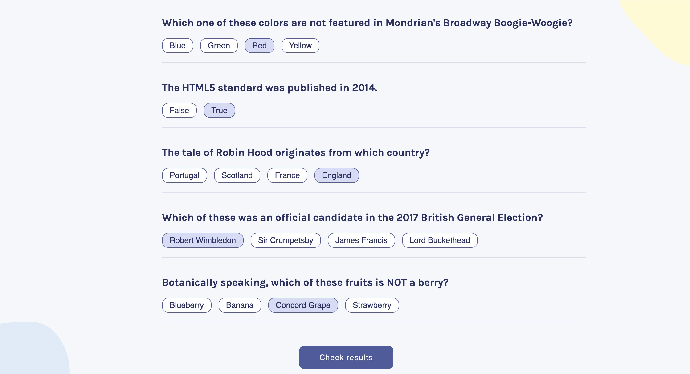
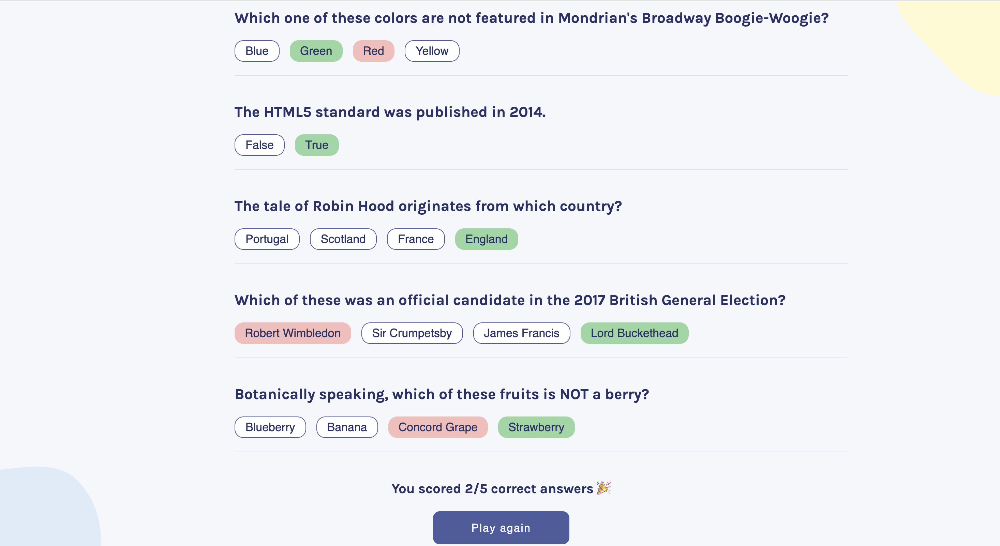

# 🎯 Quizzical Quiz App

A dynamic quiz application that lets users test their knowledge with random trivia questions.
Built with modern frontend tools and interactive UI logic.

## 🚀 Live Demo

You can try the app here:
👉 https://quizzical-game-app.netlify.app/

---

## 📖 About the Project

Quizzical is a trivia quiz app that fetches random questions from an external API and allows users to select answers, check their results, and restart the quiz.

The goal of this project was to practice working with React state, dynamic rendering, and API data.

---

## ✨ Features

* 🎲 Random quiz questions from an API
* ✅ Select and highlight answers
* 🧠 Check answers and see the score
* 🔄 Restart the quiz with new questions

---

## 🛠 Built With

* React
* JavaScript (ES6+)
* CSS
* Vite
* Open Trivia DB API

---

## ⚙️ Installation

If you want to run the project locally:

```bash
git clone https://github.com/daryna-budz/quizzical.git
cd quizzical
npm install
npm run dev
```

---


## 📦 Deployment

The project is deployed using Netlify.

To build the project:

```bash
npm run build
```

---

## 📸 Preview







---


If you liked the project, feel free to ⭐ the repository!

